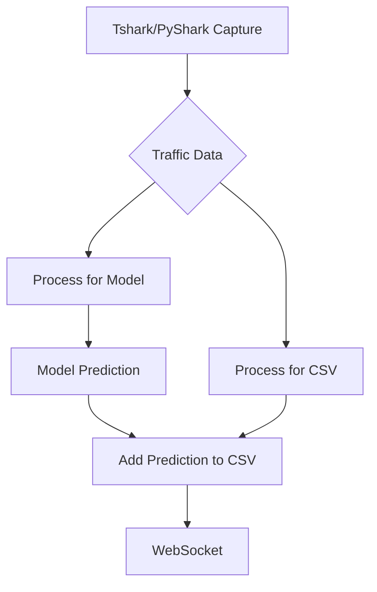

# SisaGuard Network Security

Model and predict network security threats from SisaGuard, a network security Project.

## Diagram of the Project

### Observaciones Clave

1. **Información Temporal y de Red**:
   - `Timestamp`, `Source IP Address`, `Destination IP Address`, `Source Port`, y `Destination Port` ofrecen un contexto detallado sobre cada evento de red, permitiendo análisis temporales y basados en la red.

2. **Protocolo y Tipo de Tráfico**:
   - `Protocol`, `Packet Length`, `Packet Type`, y `Traffic Type` (ICMP, UDP, TCP, HTTP, DNS) son críticos para entender la naturaleza del tráfico y podrían ser indicativos de comportamientos normales o maliciosos.

3. **Datos de Carga Útil**:
   - `Payload Data` contiene datos codificados de los paquetes, lo que podría ser analizado para detectar patrones específicos asociados con malware o ataques.

4. **Indicadores de Seguridad**:
   - `Action Taken`, `Severity Level`, `Firewall Logs`, `IDS/IPS Alerts`, y `Proxy Information` ofrecen insights sobre cómo los sistemas de seguridad han respondido a cada evento.

### Sugerencias para la Utilización del Conjunto de Datos

- **Análisis de Carga Útil**:
  - Se considera técnicas de procesamiento de lenguaje natural (NLP) para analizar el contenido de `Payload Data`, buscando firmas de malware conocidas o patrones anómalos.

- **Características Basadas en el Protocolo**:
  - `Protocol`, `Packet Type`, y `Traffic Type` pueden ser codificados (por ejemplo, usando one-hot encoding) para usarlos como características en tu modelo.

- **Análisis Temporal**:
  - Convierte `Timestamp` a un formato de fecha y hora en Python para realizar análisis que consideren la temporalidad de los ataques.

- **Modelo de Detección de Anomalías**:
  - Podrías emplear un enfoque de detección de anomalías para identificar tráfico de red que se desvía significativamente de los patrones normales, utilizando `Anomaly Scores` como una referencia.

- **Modelo de Clasificación Supervisada**:
  - Usa `Attack Type` o `Severity Level` como etiquetas para entrenar un modelo de clasificación que pueda predecir el tipo o la gravedad de los ataques basándose en las características disponibles.
