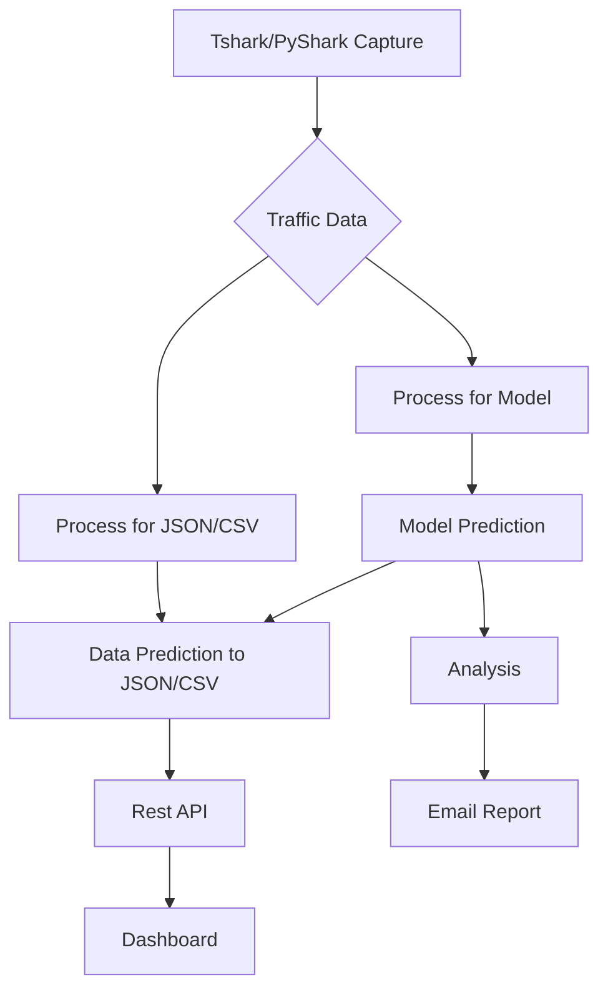

# SisaGuard Network Security

Model and predict network security threats from SisaGuard, a network security Project.

## Flowchart SiSaGuard Network Security

### Key Observations

1. **Temporal and Network Information**:
   - `Timestamp`, `Source IP Address`, `Destination IP Address`, `Source Port`, and `Destination Port` provide detailed context about each network event, enabling temporal and network-based analysis.

2. **Protocol and Type of Traffic**:
   - `Protocol`, `Packet Length`, `Packet Type`, and `Traffic Type` (ICMP, UDP, TCP, HTTP, DNS) are critical to understanding the nature of traffic and could be indicative of normal or malicious behavior.

### Suggestions for Using the Data Set

- **Payload Analysis**:
  - Natural language processing (NLP) techniques are considered to analyze the content of `Payload Data`, looking for known malware signatures or anomalous patterns.

- **Features Based on the Protocol**:
  - `Protocol`, `IP Address`, and `Ports` are used as features in the model.

- **Supervised Classification Model**:
  - Use `Attack Type` or `Severity Level` as labels to train a classification model that can predict the type or severity of attacks based on available features.
  