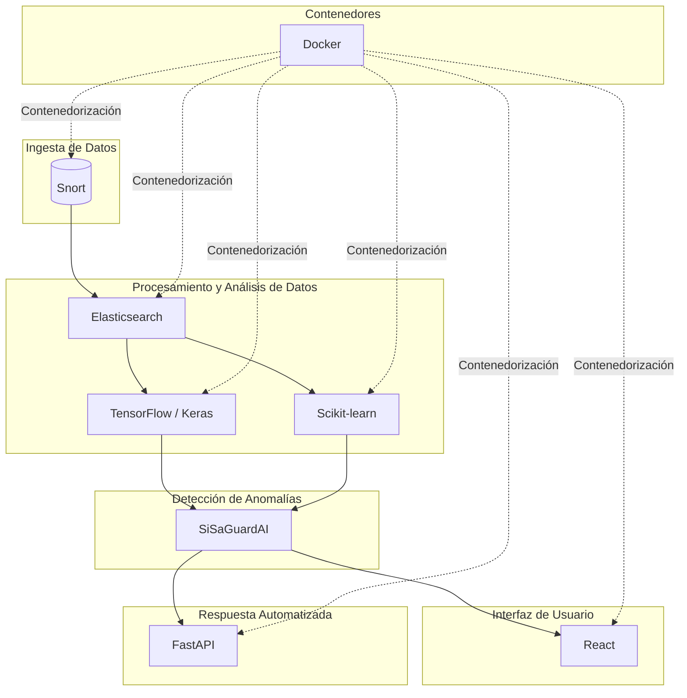

```mermaid
flowchart TB
    subgraph Ingesta de Datos
    Snort[("Snort")]
    end

    subgraph Procesamiento y Análisis de Datos
    ES[Elasticsearch]
    TF[TensorFlow / Keras]
    SK[Scikit-learn]
    end

    subgraph Detección de Anomalías
    ML[SiSaGuardAI]
    end

    subgraph Interfaz de Usuario
    React
    end

    subgraph Respuesta Automatizada
    FastAPI
    end

    subgraph Contenedores
    Docker
    end

    Snort --> ES
    ES --> TF
    ES --> SK
    TF --> ML
    SK --> ML
    ML --> React
    ML --> FastAPI
    Docker -.-> |Contenedorización| Snort
    Docker -.-> |Contenedorización| ES
    Docker -.-> |Contenedorización| TF
    Docker -.-> |Contenedorización| SK
    Docker -.-> |Contenedorización| React
    Docker -.-> |Contenedorización| FastAPI


```
